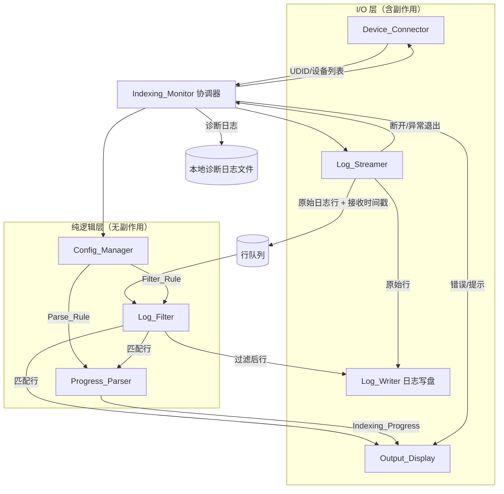
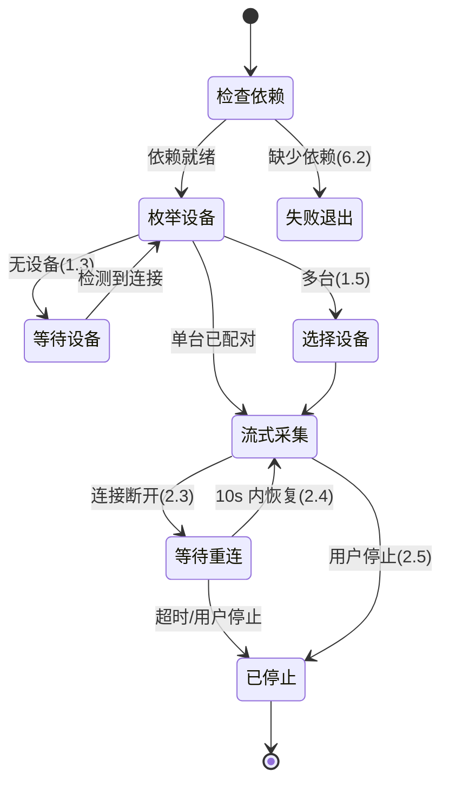
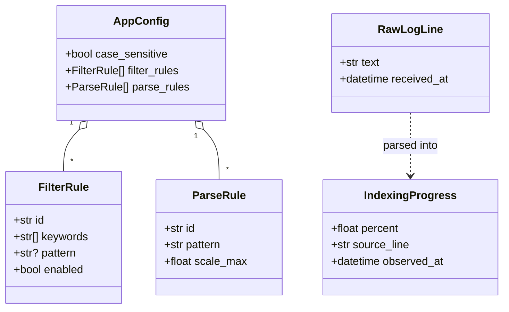

# 设计文档（Design Document）

## Overview

本工具是一个运行在 **Windows** 上的应用，用于通过 USB 读取已连接 iPhone 的实时系统日志，过滤出 Spotlight 索引相关的日志行，并解析、展示索引进度（Indexing_Progress）。其目标是替代用户原本只能在 Mac 上通过 Console.app 完成的「查看 spotlight indexing progress」工作流。

### 技术选型与理由

- **语言/运行时：Python 3.11+**
  - 子进程管理（`subprocess`）成熟，便于封装 `idevicesyslog` 的标准输出流式读取。
  - 正则、文本处理能力强，适合可配置的过滤与解析规则。
  - 拥有成熟的属性测试库 [Hypothesis](https://hypothesis.readthedocs.io/)，便于对纯逻辑（过滤/解析/配置）做属性测试。
  - 打包为 Windows 可执行（PyInstaller）后用户无需安装 Python 环境。

- **底层日志采集：libimobiledevice 套件**
  - `idevice_id -l` 枚举已连接设备的 UDID。
  - `ideviceinfo -k DeviceName` 获取设备名称、配对状态判断。
  - `idevicesyslog -u <UDID>` 流式获取实时系统日志。
  - 该套件是 Windows 上读取 iOS `os_log`/syslog（经 usbmux/lockdown over USB）的等价开源方案，对应 Mac Console 的能力。参考：[libimobiledevice](https://libimobiledevice.org/)。

- **界面：命令行界面（CLI）优先**
  - 核心场景是流式日志 + 实时进度展示，CLI 足以满足且依赖最小。
  - 进度区使用「就地刷新」（覆盖最近进度行）+ 滚动日志区的混合输出。

### 设计原则

- **分层解耦**：I/O 层（设备/流采集/磁盘/界面）与纯逻辑层（过滤/解析/配置）分离。纯逻辑层不含副作用，便于属性测试与规则热更新。
- **规则可配置且热加载**：过滤与解析规则全部从配置文件加载，可在监控运行期间替换并对后续日志行生效，无需重启日志流（需求 5.6）。
- **失败可诊断**：依赖检查、子进程退出、磁盘错误均有明确提示并写入本地诊断日志（需求 6）。

### 研究要点摘要

- iOS 各版本日志格式不稳定，**iOS 27 beta 1 是否仍打印可读进度数值不确定**。因此进度解析必须「尽力而为」：解析失败不应中断日志流，且用户可在不重启采集的情况下调整解析正则（需求 5.6、7）。这驱动了「原始日志保存/导出」（需求 7）作为人工分析的兜底手段。
- `idevicesyslog` 通过 stdout 持续输出行文本；设备拔出时进程会退出并返回非零状态——这驱动了「连接断开检测 + 10 秒内自动恢复」的设计（需求 2.3、2.4）。
- 设备锁屏时 syslog 可能无法读取或受限——需要单独的锁屏提示（需求 6.5）。

## Architecture

整体采用「采集（I/O）→ 队列 → 处理流水线（纯逻辑）→ 展示/持久化」的管道结构。`Indexing_Monitor` 作为协调器（orchestrator）连接各模块。



### 数据流与线程模型

- **采集线程**：`Log_Streamer` 在独立线程中以阻塞方式逐行读取 `idevicesyslog` 的 stdout，每读到一行即附上「本机接收时间戳」并放入线程安全队列（需求 2.2、4.5、7.3）。
- **处理线程（主循环）**：从队列取行，依次经 `Log_Filter` → `Progress_Parser`，结果送 `Output_Display` 与可选的 `Log_Writer`。
- **规则热更新**：`Config_Manager` 持有当前规则的不可变快照；当用户应用新规则时，协调器原子替换该快照引用，处理线程对后续行读取到新快照（需求 5.6）。
- **连接监控**：`Log_Streamer` 检测到子进程退出后，通知 `Indexing_Monitor`；协调器进入「等待重连」状态，在 10 秒窗口内轮询 `Device_Connector`，设备回来则自动重启流（需求 2.3、2.4）。

### 状态机（监控会话）



## Components and Interfaces

以下接口以 Python 类型签名表达；纯逻辑组件不依赖 I/O，便于测试。

### Device_Connector

负责枚举与识别经 USB 连接的 iOS 设备（需求 1）。

```python
class DeviceState(Enum):
    CONNECTED_PAIRED = "connected_paired"      # 已连接且已配对
    CONNECTED_UNPAIRED = "connected_unpaired"  # 已连接但未配对（需信任）
    LOCKED = "locked"                          # 已连接但锁屏

@dataclass(frozen=True)
class DeviceInfo:
    udid: str
    name: str | None
    state: DeviceState

class DeviceConnector:
    def enumerate_devices(self, timeout_s: float = 5.0) -> list[DeviceInfo]:
        """5 秒内枚举所有经 USB 连接的 iOS 设备（1.1、1.2）。"""

    def get_pairing_state(self, udid: str) -> DeviceState:
        """判断设备的配对/锁屏状态（1.4、6.5）。"""
```

### Log_Streamer

封装 `idevicesyslog`，以流式方式产出带时间戳的日志行（需求 2）。

```python
@dataclass(frozen=True)
class RawLogLine:
    text: str
    received_at: datetime   # 本机接收时间戳（4.5、7.3）

class StreamEvent(Enum):
    LINE = "line"
    DISCONNECTED = "disconnected"   # 2.3
    PROCESS_EXITED = "process_exited"  # 6.3

class LogStreamer:
    def start(self, udid: str, sink: "Queue[RawLogLine]") -> None:
        """启动底层日志流并逐行写入队列（2.1、2.2）。"""

    def stop(self) -> None:
        """终止底层进程并释放资源（2.5）。"""

    def on_event(self, callback: Callable[[StreamEvent, int | None], None]) -> None:
        """注册流事件回调，回传子进程退出码（2.3、6.3）。"""
```

### Log_Filter（纯逻辑）

依据 Filter_Rule 集合判断日志行是否匹配（需求 3）。

```python
@dataclass(frozen=True)
class FilterRule:
    id: str
    keywords: tuple[str, ...]      # 关键字集合
    pattern: str | None = None     # 可选正则
    enabled: bool = True

class LogFilter:
    def __init__(self, rules: Sequence[FilterRule], case_sensitive: bool = False): ...

    def matches(self, line: str) -> bool:
        """若行匹配任一启用规则则返回 True（3.1、3.2、3.5）。"""

    def filter_stream(self, lines: Iterable[RawLogLine]) -> Iterator[RawLogLine]:
        """仅产出匹配的行；不匹配的行被丢弃（3.3）。"""
```

### Progress_Parser（纯逻辑）

从已过滤的日志行中提取并规范化索引进度（需求 4）。

```python
@dataclass(frozen=True)
class ParseRule:
    id: str
    pattern: str        # 含一个捕获组，捕获进度数值
    scale_max: float = 100.0  # 捕获值的量程上限，用于规范化到 0..100

@dataclass(frozen=True)
class IndexingProgress:
    percent: float          # 规范化后 0..100
    source_line: str        # 对应原始日志行（4.3）
    observed_at: datetime   # 提取时间戳（4.4、4.5）

class ProgressParser:
    def __init__(self, rules: Sequence[ParseRule]): ...

    def parse(self, line: RawLogLine) -> IndexingProgress | None:
        """尝试提取进度；无法识别则返回 None（4.1、4.2）。"""

    @staticmethod
    def normalize(value: float, scale_max: float) -> float:
        """将 [0, scale_max] 的值规范化并钳制到 [0, 100]（4.2）。"""
```

### Config_Manager

加载、保存、校验过滤与解析规则（需求 5）。

```python
@dataclass(frozen=True)
class AppConfig:
    filter_rules: tuple[FilterRule, ...]
    parse_rules: tuple[ParseRule, ...]
    case_sensitive: bool = False

class ConfigError(Exception): ...

class ConfigManager:
    DEFAULT_KEYWORDS = ("spotlight", "indexing", "progress", "mds", "corespotlight")

    def load(self, path: Path) -> AppConfig:
        """加载配置；缺失则写默认配置并返回默认值；无效则报错并回退默认（5.1、5.2、5.3）。"""

    def save(self, path: Path, config: AppConfig) -> None:
        """校验后持久化（5.4）。"""

    @staticmethod
    def validate(config: AppConfig) -> list[str]:
        """返回校验错误列表（空列表表示有效）；校验所有正则可编译（5.4、5.5）。"""

    @staticmethod
    def default_config() -> AppConfig:
        """内置默认规则（3.4、5.2）。"""
```

### Output_Display

展示过滤后的日志行与最新进度（需求 4、6 的提示）。

```python
class OutputDisplay:
    def show_devices(self, devices: list[DeviceInfo]) -> None: ...      # 1.2、1.5
    def show_log_line(self, line: RawLogLine) -> None: ...              # 3.2、4.5
    def update_progress(self, progress: IndexingProgress) -> None: ...  # 4.3、4.4
    def show_notice(self, message: str) -> None: ...                    # 1.3、1.4、6.2、6.5
    def show_error(self, message: str) -> None: ...                     # 6.3
```

### Log_Writer

将原始/过滤后日志写入用户指定文件（需求 7）。

```python
class ExportMode(Enum):
    RAW = "raw"          # 全部原始日志
    FILTERED = "filtered"  # 仅过滤后日志

class LogWriter:
    def open(self, path: Path) -> None:
        """打开目标文件；不可写则抛出错误（7.4）。"""

    def write(self, line: RawLogLine) -> None:
        """写入一行并保留接收时间戳（7.1、7.3）。"""

    def export(self, path: Path, lines: Sequence[RawLogLine], mode: ExportMode) -> None:
        """按模式导出（7.2）。"""
```

### Indexing_Monitor（协调器）

串联依赖检查、设备选择、流采集、规则热更新、错误处理与诊断日志（需求 1、2、5.6、6）。

```python
class IndexingMonitor:
    def run(self) -> int: ...                       # 主入口
    def check_dependencies(self) -> list[str]: ...  # 6.1、6.2
    def apply_rules(self, config: AppConfig) -> None: ...  # 热更新（5.6）
    def log_diagnostic(self, detail: str) -> None: ...     # 6.4
```

## Data Models

### 配置文件格式（JSON）

```json
{
  "case_sensitive": false,
  "filter_rules": [
    {
      "id": "default-keywords",
      "keywords": ["spotlight", "indexing", "progress", "mds", "corespotlight"],
      "pattern": null,
      "enabled": true
    }
  ],
  "parse_rules": [
    {
      "id": "percent-generic",
      "pattern": "progress[^0-9]*([0-9]{1,3}(?:\\.[0-9]+)?)\\s*%",
      "scale_max": 100.0
    },
    {
      "id": "fraction-generic",
      "pattern": "([0-9]+)\\s*/\\s*([0-9]+)\\s*items",
      "scale_max": 1.0
    }
  ]
}
```

### 核心实体关系



### 数据约束与不变量

- `IndexingProgress.percent` 恒在闭区间 `[0, 100]` 内（规范化 + 钳制，需求 4.2）。
- `RawLogLine.received_at` 在采集时即被赋值且不可变，贯穿过滤、解析、写盘各阶段（需求 4.5、7.3）。
- `AppConfig` 中所有 `ParseRule.pattern` 与 `FilterRule.pattern` 必须能成功编译为正则（需求 5.5）。
- 过滤是「保持子集」操作：输出行集合是输入行集合的子集，且保持原有到达顺序。

## Correctness Properties

*属性（property）是指在系统所有有效执行下都应成立的特征或行为——本质上是关于「系统应当做什么」的形式化陈述。属性是连接人类可读规格与机器可验证正确性保证之间的桥梁。*

下列属性均针对纯逻辑层（Log_Filter、Progress_Parser、Config_Manager）以及可隔离测试的数据流不变量。每条属性来源于具体验收标准，并已按 prework 做过去冗余合并。

### Property 1: 过滤正确性（保留当且仅当匹配）

*对任意* 日志行序列与任意 Filter_Rule 集合，一行被保留（传递给下游）当且仅当它匹配至少一条启用的规则；且输出行集合是输入行集合的保序子集。

**Validates: Requirements 3.1, 3.2, 3.3**

### Property 2: 默认关键字大小写不敏感匹配

*对任意* 包含默认关键字（spotlight、indexing、progress、mds、corespotlight）之一（以任意大小写变体出现）的日志行，默认 Filter_Rule 在大小写不敏感模式下应判定为匹配。

**Validates: Requirements 3.4**

### Property 3: 大小写敏感性元变换

*对任意* 日志行与关键字规则，大小写不敏感模式下的匹配集合是大小写敏感模式下匹配集合的超集；即将匹配模式从不敏感切到敏感，绝不会使原本不匹配的行变为匹配。

**Validates: Requirements 3.5**

### Property 4: 进度规范化区间不变量

*对任意* 数值与量程上限 scale_max，规范化结果恒落在闭区间 [0, 100] 内；因此任意成功解析得到的 IndexingProgress.percent 恒满足 0 ≤ percent ≤ 100。

**Validates: Requirements 4.2**

### Property 5: 进度解析往返

*对任意* 百分比值 p ∈ [0, 100]，使用与某 ParseRule 匹配的模板构造一行包含 p 的日志，经 Progress_Parser 解析后得到的 percent 应等于 p（在浮点容差内）。

**Validates: Requirements 4.1, 4.2**

### Property 6: 最近进度保持

*对任意* 进度提取结果序列（其中部分行解析成功、部分返回 None），在任一时刻 Output_Display 展示的「最近进度」等于该时刻为止最后一个成功解析的 IndexingProgress；若尚无成功解析，则不展示任何进度。

**Validates: Requirements 4.4**

### Property 7: 跨阶段时间戳保持

*对任意* RawLogLine，从采集时被赋予的 received_at，在经过过滤、解析、展示与写盘各阶段后保持不变（既不丢失也不被改写）。

**Validates: Requirements 4.5, 7.3**

### Property 8: 到达顺序保持

*对任意* 日志行序列，Log_Streamer 传递给下游处理流水线的顺序与其到达（被采集）的顺序一致。

**Validates: Requirements 2.2**

### Property 9: 配置序列化往返

*对任意* 有效的 AppConfig，先 save 到文件再 load 回来，应得到与原配置等价的对象（filter_rules、parse_rules、case_sensitive 全部一致）。

**Validates: Requirements 5.1, 5.4**

### Property 10: 正则校验正确性

*对任意* 字符串，Config_Manager.validate 接受该字符串作为 pattern 当且仅当它能被成功编译为正则表达式；可编译者通过校验，不可编译者被拒绝并报告错误。

**Validates: Requirements 5.5**

### Property 11: 无效配置回退默认（边界）

*对任意* 无效或损坏的配置文件内容（非法 JSON、缺字段、错误类型），load 不抛出未捕获异常，而是返回内置默认配置并报告错误。

**Validates: Requirements 5.3**

### Property 12: 规则热更新等价

*对任意* 旧规则集、新规则集与后续日志行序列，在监控运行期间应用新规则后，每条后续行经过滤/解析的结果，等于直接以新规则从头处理该行所得的结果（即热更新与重启后处理等价）。

**Validates: Requirements 5.6**

### Property 13: 导出模式正确性

*对任意* 日志行序列与 Filter_Rule 集合：以 RAW 模式导出的内容等于全部输入行；以 FILTERED 模式导出的内容恰好等于 Log_Filter 作用于该序列的结果。

**Validates: Requirements 7.2**

### Property 14: 写盘往返

*对任意* 日志行序列，启用日志保存写入文件后再读回，应保留每一行的文本内容与本机接收时间戳，且顺序不变。

**Validates: Requirements 7.1, 7.3**

## Error Handling

错误处理遵循「明确分类 → 用户可读提示 → 写入诊断日志 → 尽量不中断采集」的原则（需求 6）。

| 场景 | 触发条件 | 处理方式 | 验收标准 |
|------|----------|----------|----------|
| 依赖缺失 | 启动时 libimobiledevice 可执行文件或 USB 驱动不可用 | 列出具体缺失项与修复指引（如安装/PATH 配置），并终止启动 | 6.1, 6.2 |
| 无设备 | 枚举返回空 | 提示连接设备并解锁屏幕，进入「等待设备」状态 | 1.3 |
| 未配对 | 设备状态为 CONNECTED_UNPAIRED | 提示在 iPhone 上点击「信任此电脑」 | 1.4 |
| 设备锁屏 | 已连接但读取受限/状态为 LOCKED | 提示用户解锁设备 | 6.5 |
| 连接断开 | idevicesyslog 子进程退出（设备拔出） | 停止当前流，发出 DISCONNECTED，进入 10 秒重连窗口 | 2.3, 2.4 |
| 采集进程异常退出 | 子进程返回非零退出码 | 捕获退出码，向用户显示错误原因，写诊断日志 | 6.3, 6.4 |
| 配置文件缺失 | load 时文件不存在 | 使用默认规则并生成默认配置文件 | 5.2 |
| 配置文件无效 | JSON 解析失败 / 字段非法 / 正则不可编译 | 显示错误信息，回退内置默认规则 | 5.3, 5.5 |
| 保存路径不可写 | 打开/写入目标文件失败 | 显示错误信息并停止保存操作（不影响采集） | 7.4 |

- **统一诊断日志**：所有错误均通过 `IndexingMonitor.log_diagnostic` 写入本地诊断日志文件，含时间戳、错误类别与详情（需求 6.4）。
- **解析失败非致命**：Progress_Parser 返回 None 不视为错误，不中断日志流——这是应对 iOS 27 beta 1 格式不确定性的关键设计（需求 4.1、5.6、7）。

## Testing Strategy

采用「单元测试 + 属性测试 + 集成测试」三层互补策略。

### 属性测试（Property-Based Testing）

适用于纯逻辑层（Log_Filter、Progress_Parser、Config_Manager）与可隔离的数据流不变量，这些组件有明确的输入/输出且存在普遍成立的属性（过滤、规范化、序列化往返、正则校验等）。

- **库**：使用 [Hypothesis](https://hypothesis.readthedocs.io/)（Python），不自行实现属性测试框架。
- **迭代次数**：每个属性测试至少运行 100 次随机迭代（`@settings(max_examples=100)` 或更高）。
- **标注**：每个属性测试以注释标注其对应的设计属性，格式为：
  `# Feature: iphone-spotlight-indexing-monitor, Property {number}: {property_text}`
- **覆盖**：上文 Property 1–14，每条属性以**单个**属性测试实现。
- **生成器要点**：
  - 日志行生成器需覆盖空行、超长行、非 ASCII/编码异常字符、含/不含关键字、含百分比与分数格式等边界，以满足解析与过滤的边界覆盖。
  - 正则字符串生成器需同时产出可编译与不可编译样本（Property 10、11）。
  - 配置生成器需产出多样但有效的 AppConfig（Property 9、12、13）。

### 单元测试（示例与边界）

聚焦具体示例、交互与错误条件，避免与属性测试重复覆盖输入空间：

- 设备展示与选择：1.2、1.3、1.4、1.5
- 流生命周期：启动 2.1、断开 2.3、重连 2.4、停止 2.5
- 进度展示：4.3
- 配置缺失生成默认：5.2
- 依赖检查与错误提示：6.2、6.3、6.4、6.5
- 保存路径不可写：7.4

### 集成测试（外部依赖）

针对 libimobiledevice 与子进程封装，使用 1–3 个代表性示例（真实设备或 mock 子进程）：

- 设备枚举与超时：1.1
- idevicesyslog 启动与逐行读取：2.1、2.2 的端到端验证
- 子进程异常退出捕获：6.3

### 冒烟测试（Smoke）

- 启动时依赖可用性检查：6.1（单次执行）。
